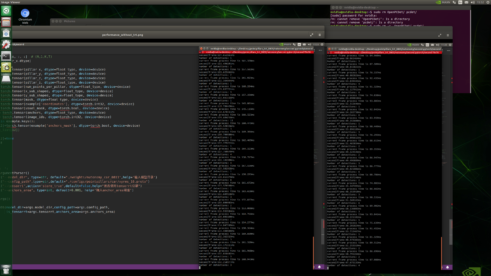
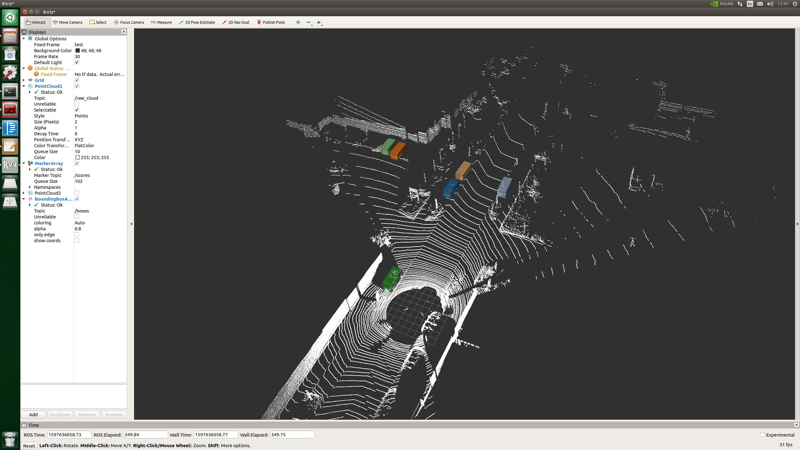

# PointPillars (train with CUDA and inference with TensorRT)

A rewrite verson of Lidar detection deeplearning framework ([PointPillars](https://github.com/traveller59/second.pytorch)) for autonomous-driving (pc or vehicle computer) applications.

# What's this

you can use it to achieve fast Lidar detection in your autoware comuter. (only test in Nvidia Xavier: each frame process less than 50 ms)

## The overall workflow is as follow:
```
1: Training and evaluating on your GPU device with Pytorch to get the suitable weights
2: Transfer the original submodels (with weights)to tensorrt version(pfn.trt and bankbone.trt).
3: Detecting objects of original pointcloud (x,y,z,intensity) on vehicle device.
```
## The Repositories Overview 
```
├── core
├── data
├── docs
├── libs
│   ├── ops
│   │   ├── cc
│   │   │   └── nms
│   │   ├── non_max_suppression
│   │   └── point_cloud
│   └── tools
│       └── buildtools
├── logs
├── models
│   ├── bones                        <------ The sub-modules list here
│   └── detectors                    <------ The Main network lies here
└── params
    ├── configs
    ├── {./Path/to/your TensorRT files(.trt)}
    └── {./Path/to/your weights files(.ckpt)}
```
# Requirements

## Hardware (used two different GPUs device)
```
- 2070Ti：
    ├── SM-75                       
    └── 4GB or more of memory
- Nvidia Jstson AGX xavier:        
    └── SM-72
```

## Software
 - ONLY supports python 3.6+, pytorch 1.1+, Ubuntu 16.04/18.04.
 - CUDA 9.0+
 - CuDNN 7+
 - TensorRT 6.0 (only need for xavier)
 
# Install
1.Refer to [TRAIN.md](docs/TRAIN.md) for the installation of the training stage of PointPillars on 2070Ti.

2.Refer to [INFERENCE.md](docs/INFERENCE.md) for the installation of the inference stage of PointPillars on xavier.

#Performance

## Faster runtime!
This is mainly due to TensorRT, which makes the network runs `four times` faster than the original version.(test on Nvidia Xavier)


## Accuracy
Emmmm.....It seem doesn't look bad either..lmao. 


# References


